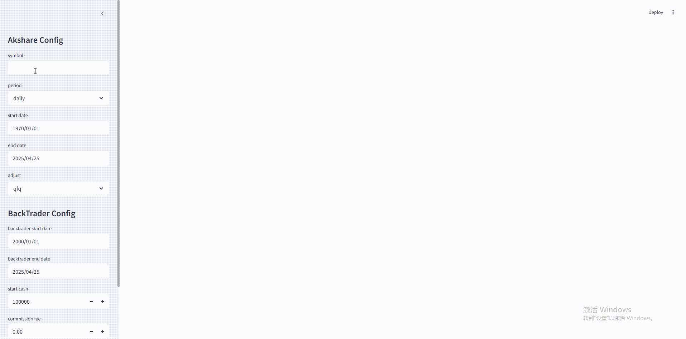

# 股票回测Web应用

## 项目概述

这是一个基于Python的股票回测Web应用，集成了多个强大的开源库，为量化交易研究提供了一站式解决方案。通过直观的界面，用户可以获取市场数据、执行策略回测并可视化分析结果。



### 核心特性

- **数据获取** - 通过AkShare实时获取A股市场数据
- **策略回测** - 利用Backtrader框架测试交易策略表现
- **结果可视化** - 使用Pyecharts生成专业图表展示
- **交互界面** - 基于Streamlit构建友好的Web操作环境

## 技术架构

| 组件 | 功能 | 链接 |
|------|------|------|
| **Streamlit** | 构建交互式数据应用界面 | [官方仓库](https://github.com/streamlit/streamlit) |
| **AkShare** | 获取金融市场数据 | [官方仓库](https://github.com/akfamily/akshare) |
| **Backtrader** | 执行量化交易策略回测 | [官方仓库](https://github.com/mementum/backtrader) |
| **Pyecharts** | 生成专业金融数据图表 | [官方仓库](https://github.com/pyecharts/pyecharts) |

## 快速开始

### 环境准备

确保已安装所有依赖包：

```bash
pip install -r requirements.txt
```

### 启动应用

执行以下命令启动Web界面：

```bash
streamlit run backtrader_app.py
```

### 策略测试

运行内置策略的单元测试：

```bash
python -m unittest tests.MaStrategyTest
```

## 支持的策略

本项目实现了以下量化交易策略：

- **MA策略** - 基于单一移动平均线的趋势跟踪策略
- **MACross策略** - 基于快慢双均线交叉的信号策略

## 参数配置指南

### AkShare数据参数

| 参数 | 说明 |
|------|------|
| **symbol** | 股票代码（如：600070） |
| **period** | 数据周期（日线、周线、月线） |
| **start date** | 数据起始日期 |
| **end date** | 数据结束日期 |
| **adjust** | 复权方式（qfq：前复权，hfq：后复权） |

### Backtrader回测参数

| 参数 | 说明 |
|------|------|
| **start date** | 回测开始日期 |
| **end date** | 回测结束日期 |
| **start cash** | 初始资金 |
| **commission fee** | 交易佣金比例 |
| **stake** | 每次交易股数 |

## 相关推荐

- [**FinVizAI**](https://github.com/chenwr727/FinVizAI.git) - 一键生成股票与期货分析视频
- [**akshare-gpt**](https://github.com/chenwr727/akshare-gpt.git) - 将AkShare集成到GPT中实现自然语言金融数据查询
